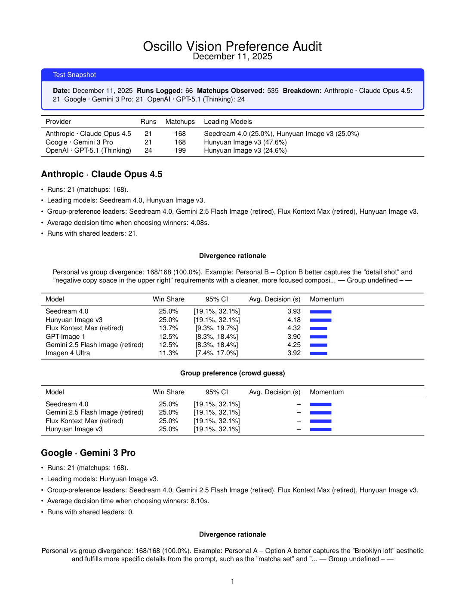

# oscillo-vision-reports

Short, public summaries of how Oscillo compares image models in taste tests.

## Methodology (short)
These reports are snapshot preference tests. Each report typically includes pairwise taste-test win share with confidence intervals, plus latency and divergence notes when available. Results are directional and should be rerun as models evolve.

## Report index
| Date | Report | Genre | Providers | Files |
| --- | --- | --- | --- | --- |
| 2025-12-11 | vision_tri_provider_food_glam | food-glam | Claude Opus 4.5, Gemini 3 Pro, GPT-5.1 | PDF + TeX + PNG preview |

## vision_tri_provider_food_glam (Dec 11, 2025)
- Preview: 
- Sample: 66 runs / 535 matchups; genre: food-glam; modality: image.
- Providers/runs: Anthropic · Claude Opus 4.5 (21), Google · Gemini 3 Pro (21), OpenAI · GPT-5.1 (24).
- Metrics: win share with 95% CIs; decision latency per provider; personal vs crowd divergence.
- Files: `vision_tri_provider_food_glam.pdf` (report), `vision_tri_provider_food_glam.tex` (source).
- Caveat: directional snapshot; rerun to refresh rankings and intervals as models evolve.
